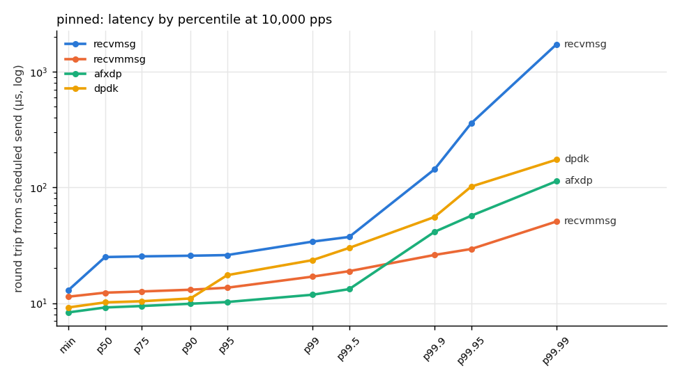
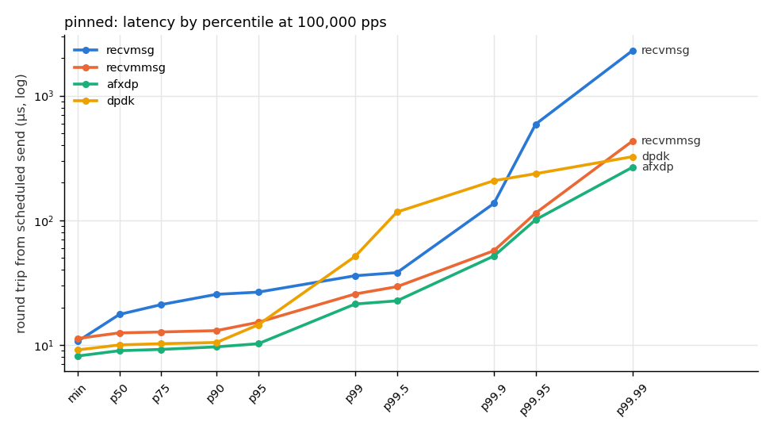
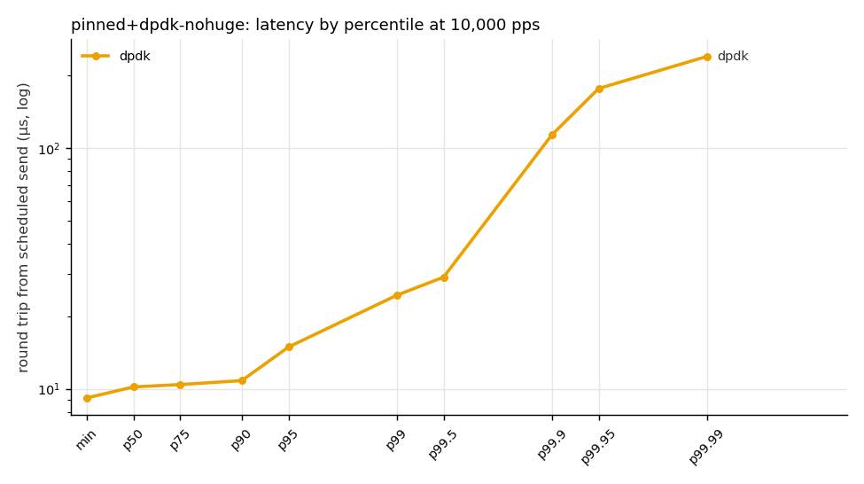
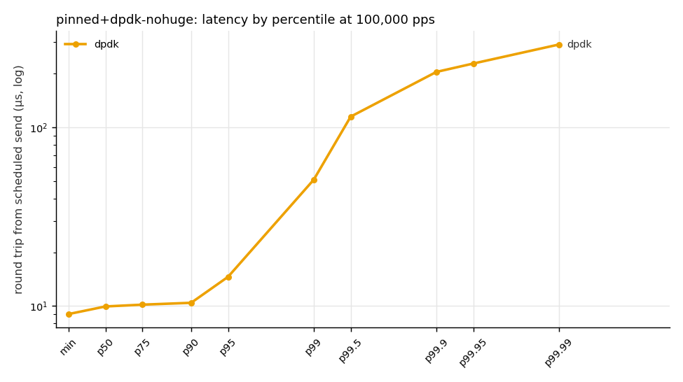
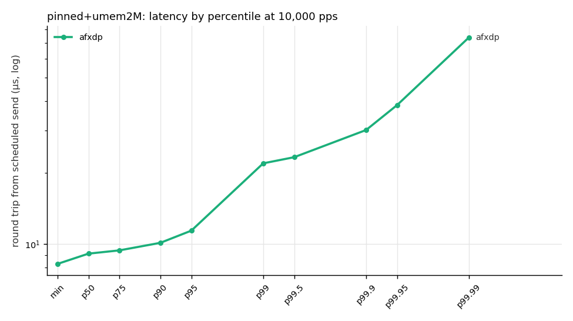
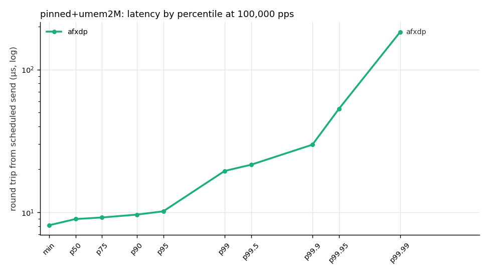
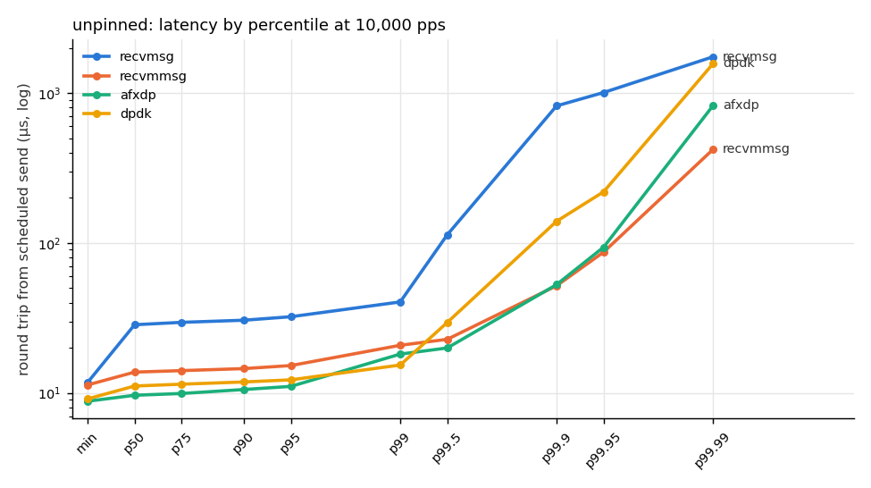
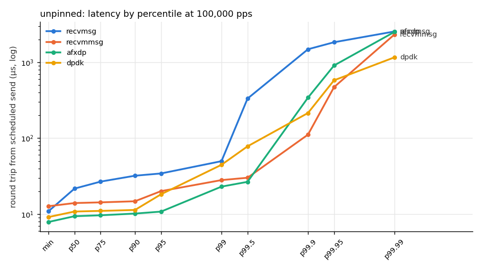
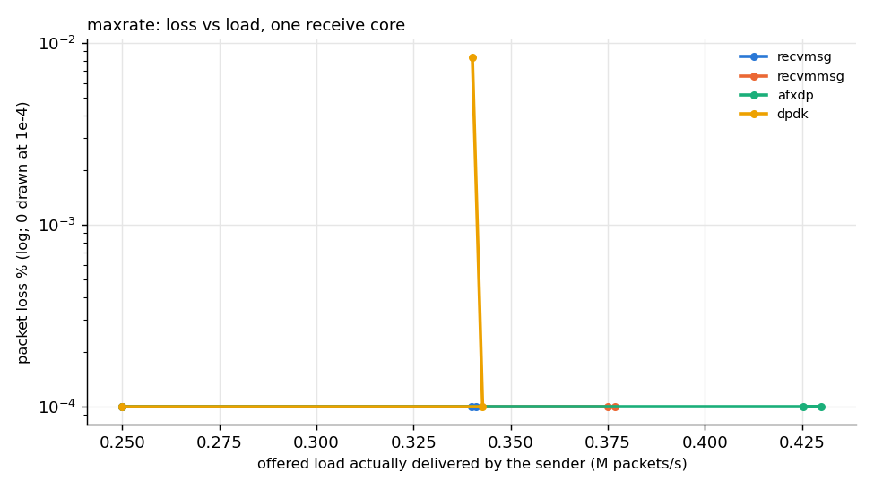

# CI veth pair (GitHub ubuntu-24.04 runner) — functional e2e, not NIC numbers

Source: `results/ci-veth` — generated by `analysis/report.py`.

## Round-trip latency

Measured on the sender's clock from the packet's *scheduled* send time to the echo's arrival (warm-up dropped). The `from send` column is the same samples measured from actual send time.

| config | path | rate (pps) | reps | samples/rep | p50 µs | p99 µs | p99.9 µs | max µs (worst rep) | lost (all reps) | checksum |
|---|---|---:|---:|---:|---:|---:|---:|---:|---:|---|
| pinned | recvmsg | 10,000 | 3 | 75,000 | 25.0 (25.0–25.0) | 30.1 (29.6–36.9) | 72.0 (50.7–634.0) | 3,223.2 | 0 | ok |
| pinned | recvmmsg | 10,000 | 3 | 75,000 | 12.3 (12.3–12.3) | 16.9 (16.0–19.4) | 20.3 (20.0–30.6) | 545.2 | 0 | ok |
| pinned | afxdp | 10,000 | 3 | 75,000 | 9.2 (9.1–9.2) | 11.8 (11.8–11.9) | 40.9 (31.1–49.1) | 477.2 | 0 | ok |
| pinned | dpdk | 10,000 | 3 | 75,000 | 10.1 (10.1–10.2) | 22.8 (14.7–24.9) | 48.3 (32.6–87.2) | 232.8 | 0 | ok |
| pinned | recvmsg | 100,000 | 3 | 750,000 | 17.5 (17.4–17.7) | 36.6 (33.9–37.0) | 61.7 (47.7–504.6) | 3,038.9 | 0 | ok |
| pinned | recvmmsg | 100,000 | 3 | 750,000 | 12.5 (12.4–12.5) | 25.2 (22.9–27.6) | 58.6 (31.8–93.6) | 790.4 | 0 | ok |
| pinned | afxdp | 100,000 | 3 | 750,000 | 9.0 (8.9–9.0) | 21.2 (21.1–21.7) | 47.7 (32.0–68.3) | 1,620.3 | 0 | ok |
| pinned | dpdk | 100,000 | 3 | 750,000 | 10.0 (10.0–10.0) | 33.6 (31.8–92.1) | 173.2 (171.6–247.9) | 725.2 | 0 | ok |
| pinned+dpdk-nohuge | dpdk | 10,000 | 3 | 75,000 | 10.2 (10.1–10.2) | 22.7 (13.9–28.4) | 111.3 (87.1–143.6) | 502.6 | 0 | ok |
| pinned+dpdk-nohuge | dpdk | 100,000 | 3 | 750,000 | 10.0 (9.9–10.0) | 66.1 (27.4–70.2) | 210.2 (144.7–227.9) | 585.7 | 0 | ok |
| pinned+umem2M | afxdp | 10,000 | 3 | 75,000 | 9.1 (9.1–9.2) | 12.2 (11.1–24.0) | 17.7 (14.2–44.0) | 236.9 | 0 | ok |
| pinned+umem2M | afxdp | 100,000 | 3 | 750,000 | 9.0 (8.9–9.0) | 20.6 (19.0–21.1) | 34.0 (27.0–34.3) | 573.8 | 0 | ok |
| unpinned | recvmsg | 10,000 | 3 | 75,000 | 28.8 (27.2–29.2) | 39.2 (36.6–72.5) | 784.3 (726.1–831.8) | 2,745.3 | 0 | ok |
| unpinned | recvmmsg | 10,000 | 3 | 75,000 | 13.8 (13.5–13.9) | 16.4 (15.5–22.6) | 39.8 (22.2–102.0) | 1,046.3 | 0 | ok |
| unpinned | afxdp | 10,000 | 3 | 75,000 | 9.6 (9.6–9.7) | 11.7 (11.4–19.7) | 50.3 (42.5–96.4) | 2,978.7 | 0 | ok |
| unpinned | dpdk | 10,000 | 3 | 75,000 | 11.2 (10.2–11.3) | 15.5 (13.9–19.2) | 109.4 (73.1–464.6) | 3,032.7 | 0 | ok |
| unpinned | recvmsg | 100,000 | 3 | 750,000 | 23.0 (19.7–23.2) | 60.0 (42.3–487.7) | 811.2 (49.8–2,005.9) | 3,020.9 | 0 | ok |
| unpinned | recvmmsg | 100,000 | 3 | 750,000 | 14.0 (13.9–14.0) | 28.0 (27.8–28.4) | 56.1 (50.9–732.7) | 3,145.3 | 0 | ok |
| unpinned | afxdp | 100,000 | 3 | 750,000 | 9.5 (8.7–9.5) | 23.0 (21.8–25.2) | 96.5 (56.5–1,450.8) | 3,055.3 | 0 | ok |
| unpinned | dpdk | 100,000 | 3 | 750,000 | 10.8 (10.8–10.8) | 43.3 (37.1–55.6) | 267.4 (123.5–451.3) | 1,579.6 | 0 | ok |

## Tuning steps, one at a time

| path | rate | config | reps | p50 µs | p99 µs | p99.9 µs | Δ median p99.9 vs `pinned` | verdict |
|---|---:|---|---:|---:|---:|---:|---:|---|
| recvmsg | 10,000 | pinned | 3 | 25.0 (25.0–25.0) | 30.1 (29.6–36.9) | 72.0 (50.7–634.0) | – | reference |
| recvmsg | 10,000 | unpinned | 3 | 28.8 (27.2–29.2) | 39.2 (36.6–72.5) | 784.3 (726.1–831.8) | +990% | worse (ranges disjoint) |
| recvmsg | 100,000 | pinned | 3 | 17.5 (17.4–17.7) | 36.6 (33.9–37.0) | 61.7 (47.7–504.6) | – | reference |
| recvmsg | 100,000 | unpinned | 3 | 23.0 (19.7–23.2) | 60.0 (42.3–487.7) | 811.2 (49.8–2,005.9) | +1215% | within noise |
| recvmmsg | 10,000 | pinned | 3 | 12.3 (12.3–12.3) | 16.9 (16.0–19.4) | 20.3 (20.0–30.6) | – | reference |
| recvmmsg | 10,000 | unpinned | 3 | 13.8 (13.5–13.9) | 16.4 (15.5–22.6) | 39.8 (22.2–102.0) | +96% | within noise |
| recvmmsg | 100,000 | pinned | 3 | 12.5 (12.4–12.5) | 25.2 (22.9–27.6) | 58.6 (31.8–93.6) | – | reference |
| recvmmsg | 100,000 | unpinned | 3 | 14.0 (13.9–14.0) | 28.0 (27.8–28.4) | 56.1 (50.9–732.7) | -4% | within noise |
| afxdp | 10,000 | pinned | 3 | 9.2 (9.1–9.2) | 11.8 (11.8–11.9) | 40.9 (31.1–49.1) | – | reference |
| afxdp | 10,000 | pinned+umem2M | 3 | 9.1 (9.1–9.2) | 12.2 (11.1–24.0) | 17.7 (14.2–44.0) | -57% | within noise |
| afxdp | 10,000 | unpinned | 3 | 9.6 (9.6–9.7) | 11.7 (11.4–19.7) | 50.3 (42.5–96.4) | +23% | within noise |
| afxdp | 100,000 | pinned | 3 | 9.0 (8.9–9.0) | 21.2 (21.1–21.7) | 47.7 (32.0–68.3) | – | reference |
| afxdp | 100,000 | pinned+umem2M | 3 | 9.0 (8.9–9.0) | 20.6 (19.0–21.1) | 34.0 (27.0–34.3) | -29% | within noise |
| afxdp | 100,000 | unpinned | 3 | 9.5 (8.7–9.5) | 23.0 (21.8–25.2) | 96.5 (56.5–1,450.8) | +102% | within noise |
| dpdk | 10,000 | pinned | 3 | 10.1 (10.1–10.2) | 22.8 (14.7–24.9) | 48.3 (32.6–87.2) | – | reference |
| dpdk | 10,000 | pinned+dpdk-nohuge | 3 | 10.2 (10.1–10.2) | 22.7 (13.9–28.4) | 111.3 (87.1–143.6) | +130% | within noise |
| dpdk | 10,000 | unpinned | 3 | 11.2 (10.2–11.3) | 15.5 (13.9–19.2) | 109.4 (73.1–464.6) | +126% | within noise |
| dpdk | 100,000 | pinned | 3 | 10.0 (10.0–10.0) | 33.6 (31.8–92.1) | 173.2 (171.6–247.9) | – | reference |
| dpdk | 100,000 | pinned+dpdk-nohuge | 3 | 10.0 (9.9–10.0) | 66.1 (27.4–70.2) | 210.2 (144.7–227.9) | +21% | within noise |
| dpdk | 100,000 | unpinned | 3 | 10.8 (10.8–10.8) | 43.3 (37.1–55.6) | 267.4 (123.5–451.3) | +54% | within noise |

## Throughput and loss

| config | path | offered pps | sender achieved pps | received pps | lost | loss % | note |
|---|---|---:|---:|---:|---:|---:|---|
| maxrate | recvmsg | 250,000 | 250,000 | 250,003 | 0 | 0.000 |  |
| maxrate | recvmsg | 500,000 | 339,991 | 339,989 | 0 | 0.000 | sender-limited |
| maxrate | recvmsg | 1,000,000 | 341,106 | 341,108 | 0 | 0.000 | sender-limited |
| maxrate | recvmmsg | 250,000 | 250,000 | 250,005 | 0 | 0.000 |  |
| maxrate | recvmmsg | 500,000 | 376,760 | 376,759 | 0 | 0.000 | sender-limited |
| maxrate | recvmmsg | 1,000,000 | 374,990 | 374,991 | 0 | 0.000 | sender-limited |
| maxrate | afxdp | 250,000 | 250,000 | 250,003 | 0 | 0.000 |  |
| maxrate | afxdp | 500,000 | 430,032 | 430,037 | 0 | 0.000 | sender-limited |
| maxrate | afxdp | 1,000,000 | 425,220 | 425,219 | 0 | 0.000 | sender-limited |
| maxrate | dpdk | 250,000 | 250,000 | 250,002 | 0 | 0.000 |  |
| maxrate | dpdk | 500,000 | 342,774 | 342,773 | 0 | 0.000 | sender-limited |
| maxrate | dpdk | 1,000,000 | 340,134 | 340,106 | 417 | 0.008 | sender-limited |

**Max sustainable rate per core** (highest offered rate with loss ≤ 0.01% before the first failing rate; achieved = what the sender actually delivered; sender-limited runs are excluded, so if every run was sender-limited the receiver's limit is simply *not measured*):

| config | path | max sustainable (achieved pps) | loss there | next rate | loss at next |
|---|---|---:|---:|---:|---:|
| maxrate | recvmsg | ≥ 250,000 (limit not reached) | 0.000% | none failed | – |
| maxrate | recvmmsg | ≥ 250,000 (limit not reached) | 0.000% | none failed | – |
| maxrate | afxdp | ≥ 250,000 (limit not reached) | 0.000% | none failed | – |
| maxrate | dpdk | ≥ 250,000 (limit not reached) | 0.000% | none failed | – |

## Plots

