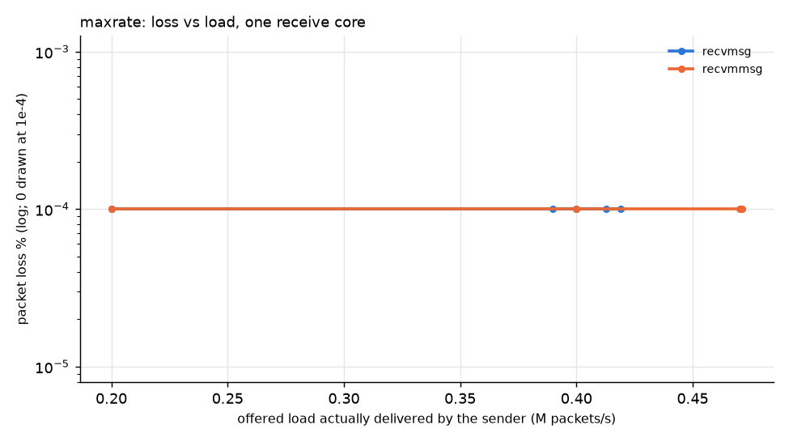
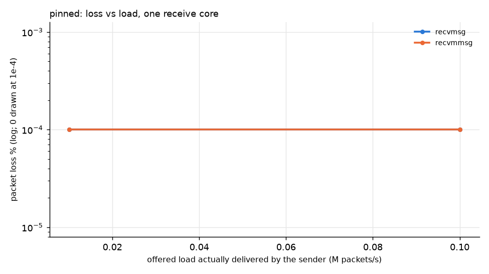
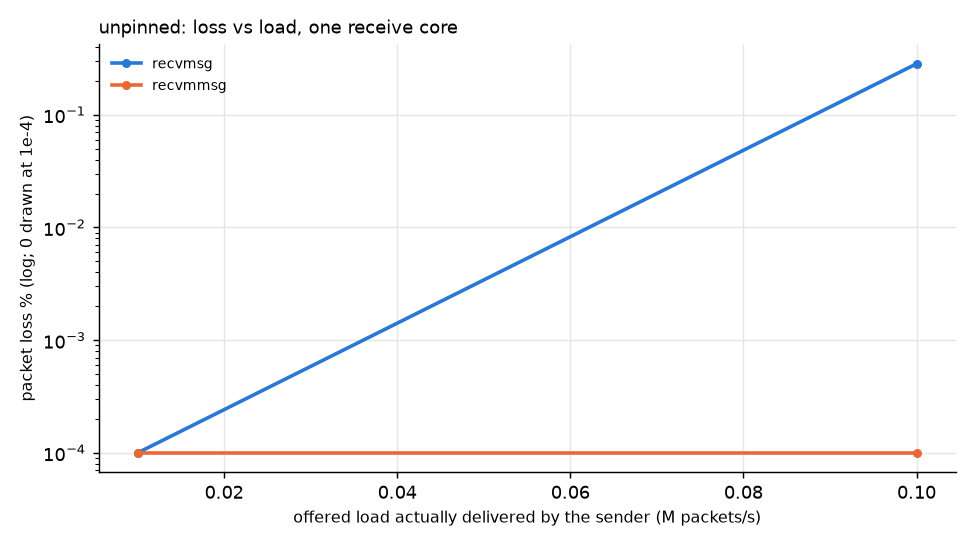

# WSL2 loopback (i5-9300H) — smoke/sanity only

Source: `results/wsl-loopback` — generated by `analysis/report.py`.

Receiver: Intel(R) Core(TM) i5-9300H CPU @ 2.40GHz, 4 vCPU, kernel 6.18.33.2-microsoft-standard-WSL2.

## Throughput and loss

| config | path | offered pps | sender achieved pps | received pps | lost | loss % | note |
|---|---|---:|---:|---:|---:|---:|---|
| maxrate | recvmsg | 200,000 | 200,000 | 200,003 | 0 | 0.000 |  |
| maxrate | recvmsg | 400,000 | 400,000 | 400,008 | 0 | 0.000 |  |
| maxrate | recvmsg | 600,000 | 418,934 | 418,933 | 0 | 0.000 | sender-limited |
| maxrate | recvmsg | 800,000 | 412,872 | 412,872 | 0 | 0.000 | sender-limited |
| maxrate | recvmsg | 1,000,000 | 389,824 | 389,824 | 0 | 0.000 | sender-limited |
| maxrate | recvmmsg | 200,000 | 200,000 | 200,001 | 0 | 0.000 |  |
| maxrate | recvmmsg | 400,000 | 400,000 | 400,002 | 0 | 0.000 |  |
| maxrate | recvmmsg | 600,000 | 471,094 | 471,093 | 0 | 0.000 | sender-limited |
| maxrate | recvmmsg | 800,000 | 470,362 | 470,360 | 0 | 0.000 | sender-limited |
| maxrate | recvmmsg | 1,000,000 | 470,985 | 470,985 | 0 | 0.000 | sender-limited |
| pinned | recvmsg | 10,000 | 10,000 | 10,000 | 0 | 0.000 |  |
| pinned | recvmsg | 100,000 | 100,000 | 99,999 | 0 | 0.000 |  |
| pinned | recvmmsg | 10,000 | 10,000 | 10,000 | 0 | 0.000 |  |
| pinned | recvmmsg | 100,000 | 100,000 | 100,000 | 0 | 0.000 |  |
| unpinned | recvmsg | 10,000 | 10,000 | 10,000 | 0 | 0.000 |  |
| unpinned | recvmsg | 100,000 | 100,000 | 99,717 | 2,836 | 0.284 |  |
| unpinned | recvmmsg | 10,000 | 10,000 | 10,000 | 0 | 0.000 |  |
| unpinned | recvmmsg | 100,000 | 100,000 | 100,000 | 0 | 0.000 |  |

**Max sustainable rate per core** (highest offered rate with loss ≤ 0.01% before the first failing rate; achieved = what the sender actually delivered; sender-limited runs are excluded, so if every run was sender-limited the receiver's limit is simply *not measured*):

| config | path | max sustainable (achieved pps) | loss there | next rate | loss at next |
|---|---|---:|---:|---:|---:|
| maxrate | recvmsg | ≥ 400,000 (limit not reached) | 0.000% | none failed | – |
| maxrate | recvmmsg | ≥ 400,000 (limit not reached) | 0.000% | none failed | – |
| pinned | recvmsg | ≥ 100,000 (limit not reached) | 0.000% | none failed | – |
| pinned | recvmmsg | ≥ 100,000 (limit not reached) | 0.000% | none failed | – |
| unpinned | recvmsg | 10,000 | 0.000% | 100,000 | 0.28% |
| unpinned | recvmmsg | ≥ 100,000 (limit not reached) | 0.000% | none failed | – |

## Plots

