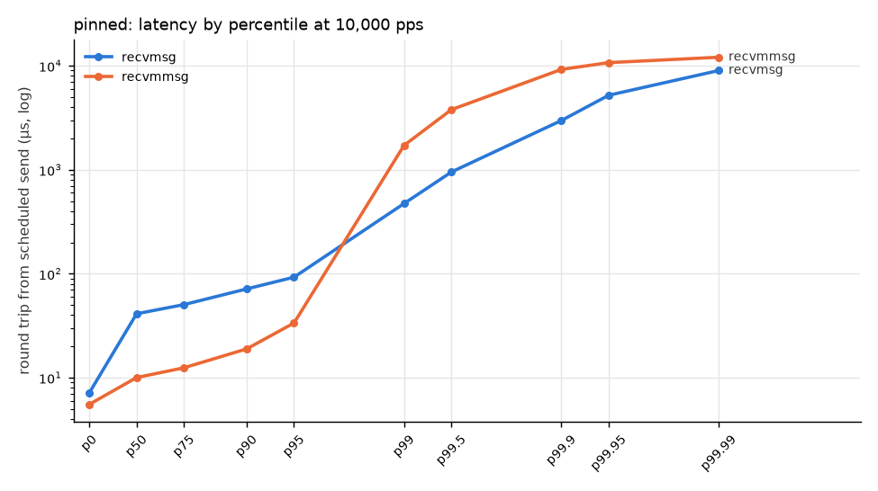
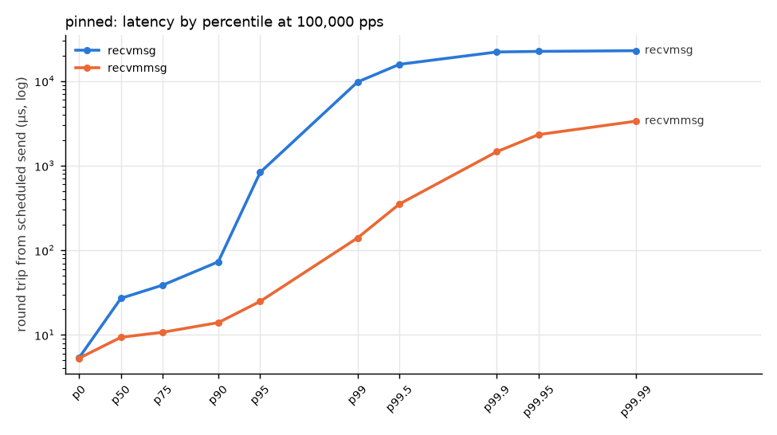
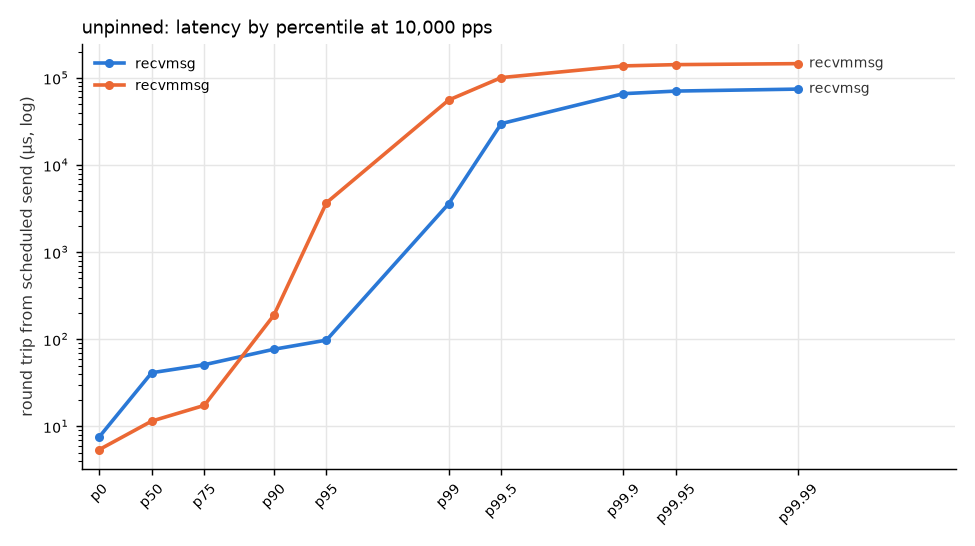
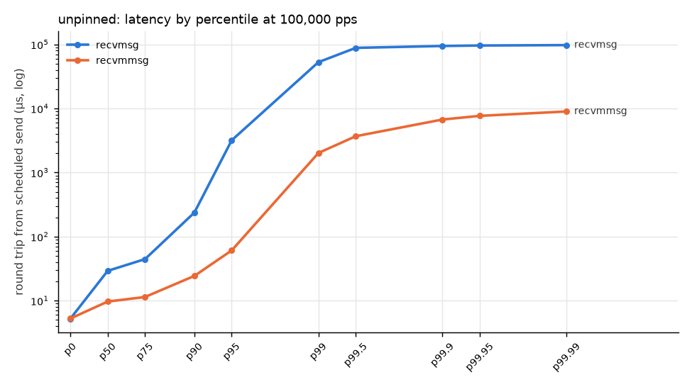

# WSL2 loopback (i5-9300H) — smoke/sanity only

Source: `results/wsl-loopback` — generated by `analysis/report.py`.

Receiver: Intel(R) Core(TM) i5-9300H CPU @ 2.40GHz, 4 vCPU, kernel 6.18.33.2-microsoft-standard-WSL2.

## Round-trip latency

Measured on the sender's clock from the packet's *scheduled* send time to the echo's arrival (warm-up dropped). The `from send` column is the same samples measured from actual send time.

| config | path | rate (pps) | samples | p50 µs | p99 µs | p99.9 µs | max µs | p99.9 from send µs | lost | checksum |
|---|---|---:|---:|---:|---:|---:|---:|---:|---:|---|
| pinned | recvmsg | 10,000 | 95,000 | 41.2 | 473.3 | 2,979.1 | 9,965.5 | 2,826.7 | 0 | ok |
| pinned | recvmmsg | 10,000 | 95,000 | 10.0 | 1,716.9 | 9,236.2 | 12,838.4 | 4,107.4 | 0 | ok |
| pinned | recvmsg | 100,000 | 950,000 | 27.0 | 9,743.8 | 22,057.4 | 22,963.2 | 21,462.5 | 0 | ok |
| pinned | recvmmsg | 100,000 | 950,000 | 9.3 | 139.7 | 1,461.2 | 3,882.9 | 780.0 | 0 | ok |
| unpinned | recvmsg | 10,000 | 95,000 | 41.3 | 3,596.4 | 66,060.8 | 75,513.2 | 66,060.8 | 0 | ok |
| unpinned | recvmmsg | 10,000 | 95,000 | 11.5 | 55,788.6 | 137,650.3 | 147,113.9 | 137,518.4 | 0 | ok |
| unpinned | recvmsg | 100,000 | 947,164 | 29.2 | 52,818.0 | 94,507.8 | 98,348.1 | 91,745.3 | 2,836 | MISMATCH |
| unpinned | recvmmsg | 100,000 | 950,000 | 9.7 | 2,018.0 | 6,719.7 | 9,723.1 | 5,027.6 | 0 | ok |

## Tuning steps, one at a time

| path | rate | config | p50 µs | p99 µs | p99.9 µs | Δp99.9 vs `pinned` |
|---|---:|---|---:|---:|---:|---:|
| recvmsg | 10,000 | pinned | 41.2 | 473.3 | 2,979.1 | – |
| recvmsg | 10,000 | unpinned | 41.3 | 3,596.4 | 66,060.8 | +2118% |
| recvmsg | 100,000 | pinned | 27.0 | 9,743.8 | 22,057.4 | – |
| recvmsg | 100,000 | unpinned | 29.2 | 52,818.0 | 94,507.8 | +328% |
| recvmmsg | 10,000 | pinned | 10.0 | 1,716.9 | 9,236.2 | – |
| recvmmsg | 10,000 | unpinned | 11.5 | 55,788.6 | 137,650.3 | +1390% |
| recvmmsg | 100,000 | pinned | 9.3 | 139.7 | 1,461.2 | – |
| recvmmsg | 100,000 | unpinned | 9.7 | 2,018.0 | 6,719.7 | +360% |

## Throughput and loss

| config | path | offered pps | sender achieved pps | received pps | lost | loss % | note |
|---|---|---:|---:|---:|---:|---:|---|
| maxrate | recvmsg | 200,000 | 200,000 | 200,003 | 0 | 0.000 |  |
| maxrate | recvmsg | 400,000 | 400,000 | 400,008 | 0 | 0.000 |  |
| maxrate | recvmsg | 600,000 | 418,934 | 418,933 | 0 | 0.000 | sender-limited |
| maxrate | recvmsg | 800,000 | 412,872 | 412,872 | 0 | 0.000 | sender-limited |
| maxrate | recvmsg | 1,000,000 | 389,824 | 389,824 | 0 | 0.000 | sender-limited |
| maxrate | recvmmsg | 200,000 | 200,000 | 200,001 | 0 | 0.000 |  |
| maxrate | recvmmsg | 400,000 | 400,000 | 400,002 | 0 | 0.000 |  |
| maxrate | recvmmsg | 600,000 | 471,094 | 471,093 | 0 | 0.000 | sender-limited |
| maxrate | recvmmsg | 800,000 | 470,362 | 470,360 | 0 | 0.000 | sender-limited |
| maxrate | recvmmsg | 1,000,000 | 470,985 | 470,985 | 0 | 0.000 | sender-limited |

**Max sustainable rate per core** (highest offered rate with loss ≤ 0.01% before the first failing rate; achieved = what the sender actually delivered; sender-limited runs are excluded, so if every run was sender-limited the receiver's limit is simply *not measured*):

| config | path | max sustainable (achieved pps) | loss there | next rate | loss at next |
|---|---|---:|---:|---:|---:|
| maxrate | recvmsg | ≥ 400,000 (limit not reached) | 0.000% | none failed | – |
| maxrate | recvmmsg | ≥ 400,000 (limit not reached) | 0.000% | none failed | – |

## Plots

